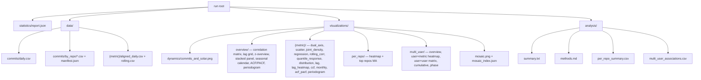

# sunspot

Correlate a GitHub user’s **public** commit history (per repository and in aggregate) with time series of **sunspot number**, **solar (F10.7)**, and **geomagnetic/ionospheric drivers** (Dst, ap from NASA OMNI2; NOAA SWPC for recent text products). Statistics and plots are **exploratory** only—not causal.

## Quickstart

```bash
uv sync --all-groups
uv run ruff check src tests
uv run pytest
```

### GitHub API rate limits

Unauthenticated calls are capped at about **60 requests per hour** per IP. Listing repos and walking commit history for many years can hit that in seconds, then the client sleeps until the hourly reset (often 20+ minutes).

**Use a token** so GitHub applies the much higher **primary rate limit (thousands of requests per hour)** for authenticated users:

```bash
# If you use GitHub CLI and are logged in:
export GITHUB_TOKEN=$(gh auth token)
uv run sunspot correlate YOUR_USER --since 2008-01-01 --until 2026-12-31 --metrics ssn,f107,dst,ap
```

Or create a **classic** personal access token at [github.com/settings/tokens](https://github.com/settings/tokens) (scopes: `public_repo` is enough for public data; for read-only you can use fine-grained tokens with repository contents read, or a classic token with no private repo scope for public-only use). Set `GITHUB_TOKEN` or `GH_TOKEN` in the environment.

The CLI logs a warning if no token is set. If you are rate-limited, logs include a short hint and the `X-RateLimit-Limit` header so you can see 60 vs 5000.

## Logging

Progress and phases go to **stderr** via the `sunspot` logger (timestamps, level, module name).

- `--log-level` `DEBUG` | `INFO` | `WARNING` | `ERROR` (default: `INFO`)
- `-v` / `--verbose` → `DEBUG` (overrides env and `--log-level`)
- `--quiet` → `WARNING` (errors and warnings only)
- `SUNSPOT_LOG_LEVEL` — used when you do **not** pass `-v` or `--quiet` and keep the default `--log-level INFO` (e.g. `export SUNSPOT_LOG_LEVEL=DEBUG`); explicit `--log-level` or `-v` / `--quiet` take precedence

Example: `uv run sunspot correlate user --since 2020-01-01 --until 2020-12-31 -v` shows GitHub repo progress, cache hits, OMNI year loads, and per-metric steps.

## CLI

```bash
uv run sunspot correlate <github_login>
# equivalent to:
#   --since <user's first GitHub commit date>   (auto-discovered)
#   --until <today UTC>
#   --metrics ssn,f107,dst,ap

# Pin the window explicitly:
uv run sunspot correlate <github_login> --since 2018-01-01 --until 2024-12-31 \
  --metrics ssn,f107,dst,ap
```

`--since` defaults to the user's earliest GitHub commit date, looked up via
`GET /search/commits?q=author:USER&sort=author-date&order=asc` (with the
account `created_at` as a fallback). `--until` defaults to today (UTC). The
solar / geomagnetic metrics are loaded for exactly the resolved
`[since, until]` window so the analysis covers the user's full history out
of the box.

By default, artifacts go to `output/correlate/{user}__{since}__{until}/` with this layout:



| Subfolder | Contents |
|-----------|----------|
| `statistics/` | `report.json` — Pearson r + Fisher-z 95 % CI, Spearman ρ + Bonett–Wright CI, optional bootstrap CI, Kendall τ, lag block (best lag, profile p-min, FDR-significant lag count), CCF (peak / Bartlett band, AR(1) pre-whitening flag), Lomb–Scargle dominant period and top-5 peaks, cross-metric matrix, per-repo top-10, multi-user top-k. |
| `data/` | `commits_daily.csv`; per-repo `commits/by_repo/*.csv` + `commits/manifest.json`; per-metric `{m}/aligned_daily.csv` and `{m}/rolling.csv`. |
| `visualizations/` | `dynamics/`, `overview/`, `per_repo/`, per-metric tiles, optional `multi_user/`, and a `mosaic.png` graphical abstract. |
| `analysis/` | `summary.txt`, `methods.md`, `per_repo_summary.csv`, `multi_user_associations.csv` (when `--compare-users` is set). |

Flags:

- **Pipeline:** `--rolling-window N` (default 90), `--lag-max N` (default 60), `--no-mosaic`, `--no-commit-cache`, `--compare-users a,b,c`.
- **Statistics depth:** `--bootstrap N` (percentile bootstrap CI, default 0 = off), `--no-prewhiten` (disable AR(1) pre-whitening for the CCF), `--top-repos N` (default 8), `--no-acf`, `--no-spectral`.
- **Plot style:** `--font-scale` (default 1.45), `--line-width` (1.9), `--dpi` (300), `--theme` (`light` | `dark`). Same knobs are also honoured via `SUNSPOT_FONT_SCALE`, `SUNSPOT_LINEWIDTH`, `SUNSPOT_DPI`, `SUNSPOT_THEME`.

Override the run root with `--out /path/to/run`. The `output/` tree is listed in `.gitignore`. Metrics:

| id | source |
|----|--------|
| `ssn` | WDC-SILSO daily total (V2.0) |
| `f107`, `dst`, `r_ssn`, `ap` | OMNI2 hourly, daily mean (SPDF) |

`r_ssn` is OMNI2’s R series (may differ slightly from SILSO `ssn`).

## Datasets and attribution

- **SILSO** (CC BY-NC 4.0): WDC-SILSO, Royal Observatory of Belgium. See [SILSO data](https://www.sidc.be/silso/DATA/) and their citation guidance.
- **NOAA SWPC** text products: U.S. government public data; [SWPC data access](https://www.swpc.noaa.gov/content/data-access).
- **OMNI2** / **SPDF**: NASA; cite Space Physics Data Facility and OMNI when publishing. Files are fetched from `spdf.gsfc.nasa.gov` (see `src/sunspot/datasets/omni.py`).

**Ionospheric note:** F10.7, Dst, and ap are **standard space-weather and geomagnetic** proxies. They are not TEC or foF2; label results accordingly.

## Caching

- Geophysical downloads: `~/.cache/sunspot/url/` (override base with `XDG_CACHE_HOME`).
- GitHub first-commit date (per login, when the CLI default `--since` is resolved): `~/.cache/sunspot/first_commit_date/*.json` (same `XDG_CACHE_HOME` base).
- GitHub commit log cache: `output/github_data/github_cache.sqlite3` (or `SUNSPOT_CACHE/github_cache.sqlite3` if set); per-repo CSVs live under `output/github_data/commit_series/` unless `SUNSPOT_COMMIT_SERIES` is set.

## License

The Python package in this repository is your project’s license; **SILSO** data remains CC BY-NC. Check NOAA/NASA terms for redistributed data in reports.

## Documentation

- [docs/README.md](docs/README.md) — modular API reference (`docs/api/*.md`) for public `sunspot` functions and subpackages
- [SPEC.md](SPEC.md) — scope, ethics, and limitations

## See also

- [src/sunspot/](src/sunspot/) — package layout and per-module `AGENTS.md`
