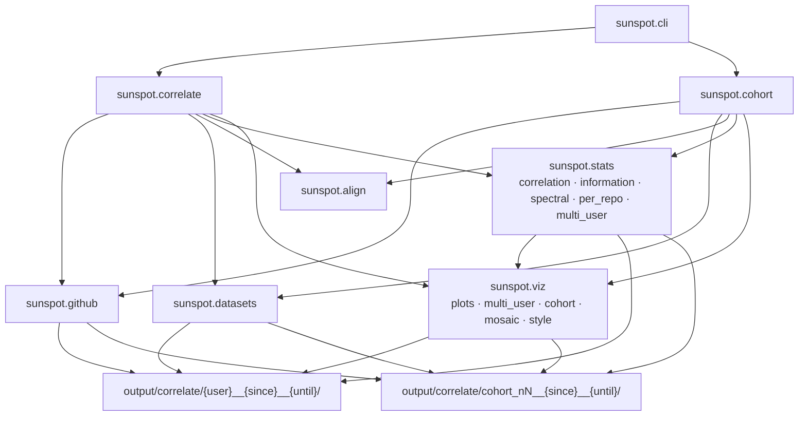

# sunspot — documentation

Narrow, module-scoped reference for the `sunspot` package. For
installation, CLI examples, and data attribution start at the
[repository README](../README.md). For product scope and limitations,
see [SPEC.md](../SPEC.md).

## Topical guides

| topic | folder | content |
|-------|--------|---------|
| Statistical methods | [`methods/`](methods/README.md) | Regression diagnostics, correlation, time-lag analysis, mutual information |
| Geophysical inputs  | [`measures/`](measures/README.md) | SSN, F10.7, Dst, Ap — physics, units, sources, pitfalls |

## API reference

| module | file |
|--------|------|
| CLI (`sunspot.cli`) — `correlate` / `cohort` | [`api/cli.md`](api/cli.md)        |
| Single-user + anchor pipeline             | [`api/correlate.md`](api/correlate.md) |
| Cohort (multi-user-only)                  | [`api/cohort.md`](api/cohort.md)  |
| Logging                                     | [`api/logutil.md`](api/logutil.md) |
| Alignment / z-scores                        | [`api/align.md`](api/align.md)    |
| Datasets (SILSO, OMNI2, NOAA, URL cache)    | [`api/datasets.md`](api/datasets.md) |
| GitHub API + commit cache                   | [`api/github.md`](api/github.md)  |
| Statistics (correlation, spectral, **information**) | [`api/stats.md`](api/stats.md) |
| Plaintext analysis tables                   | [`api/tables.md`](api/tables.md)  |
| Plots and mosaic                            | [`api/viz.md`](api/viz.md)        |

Per-package signposts: [`src/sunspot/README.md`](../src/sunspot/README.md)
and [`src/sunspot/AGENTS.md`](../src/sunspot/AGENTS.md) (and each
subpackage under `src/sunspot/`).
