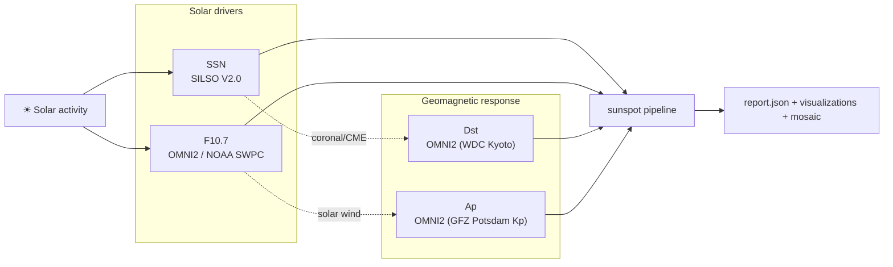

# `docs/measures/` — geophysical metrics reference

Per-dataset reference pages for the four metrics that `sunspot` aligns
against GitHub commit history. Each page describes:

- physics interpretation,
- units and observational sign convention,
- canonical source (URL pinned in the loader),
- temporal cadence and how `sunspot` resamples it to daily,
- known gaps, sentinel values, and quality flags,
- how the metric is consumed inside the pipeline (which loader, which
  alignment path, which plots emphasise it).

| metric | file | one-line role |
|--------|------|---------------|
| SSN  – sunspot number              | [`ssn.md`](ssn.md)     | direct solar activity proxy (SILSO V2.0) |
| F10.7 – 10.7 cm radio flux         | [`f107.md`](f107.md)   | chromospheric / coronal activity proxy   |
| Dst  – disturbance storm time      | [`dst.md`](dst.md)     | low-latitude geomagnetic storm intensity |
| Ap   – planetary geomagnetic index | [`ap.md`](ap.md)       | global short-time geomagnetic activity   |

## Cross-cutting notes

- **All loaders cache to disk** under `~/.cache/sunspot/url/<sha256>.…` (see
  [`docs/api/datasets.md`](../api/datasets.md)). Override with
  `XDG_CACHE_HOME` or `SUNSPOT_CACHE`.
- **All series are coerced to a daily index** in `sunspot.align.join.to_daily_dataframe`.
  Sub-daily inputs are arithmetic-mean averaged; missing days are kept as
  `NaN` and dropped pairwise inside the statistics.
- **Sign convention matters.** Dst becomes *more negative* during storms;
  every other metric becomes *more positive* during stronger activity. The
  pipeline does not flip Dst — significant *negative* correlations against
  commits are the physically meaningful direction for Dst.
- **r_ssn vs ssn.** `r_ssn` (from OMNI2) is the *Zürich/Wolf* sunspot
  number; `ssn` (from SILSO) is the modern V2.0 series. They agree in
  shape; SILSO V2.0 is recommended for new analyses.
- **Cohort / long windows.** For multi-user runs, pick a `since` that spans
  enough cycles for the metrics you care about; the CLI’s default
  [`--since-policy union`](../api/cli.md#cohort) uses the *earliest* first-commit
  date in the set so the calendar window is as long as possible.

## See also

- Statistical machinery: [`docs/api/stats.md`](../api/stats.md)
- Visualisations that consume each metric: [`docs/api/viz.md`](../api/viz.md)
- Report layout: [`output/README.md`](../../output/README.md)
