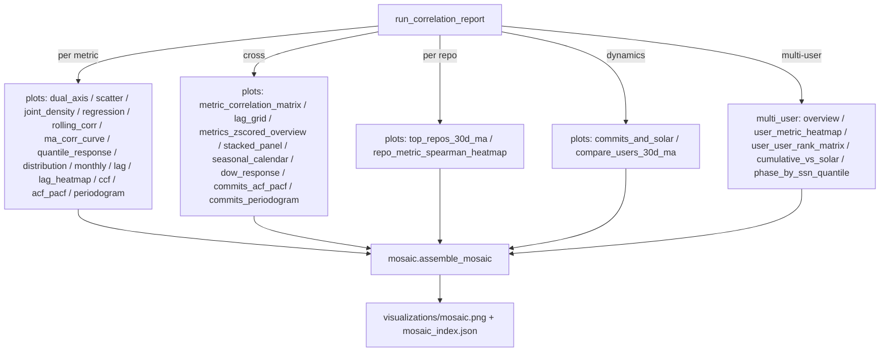

# Viz

Headless `matplotlib` (Agg). All plots share a single
[`PlotStyle`](style.py) — typography, line weight, palette and theme are
controlled in one place and overridable per call, via CLI flags
(`--font-scale`, `--line-width`, `--dpi`, `--theme`) or environment variables
(`SUNSPOT_FONT_SCALE`, `SUNSPOT_LINEWIDTH`, `SUNSPOT_DPI`,
`SUNSPOT_THEME`). Defaults are tuned for tile-in-mosaic readability:
`font_scale=1.45`, `line_width=1.9`, `dpi=300`. Every figure carries a
metadata footer with the time period and `n`, and association plots
(`scatter`, `regression`, `lag`, `rolling_corr`, `ccf`) carry APA-style
significance marks (`*** ** * · ⁿˢ`) on coefficients plus a p-value badge.

The mosaic is structured into six labelled sections (banner →
solar context → cross-metric overview → per-metric juxtaposition → per-repo →
multi-user) so the chain from "GitHub activity" to "solar context" is visible
at a glance. Tiles preserve their source pixel aspect (no stretching) and the
mosaic itself renders at the active `PlotStyle.dpi` with `cell_w=4.2"` per
column for high-fidelity zoom and print. The banner carries the same
significance-stars legend used in the per-tile titles.

All functions create parent directories as needed and use the same
`out: Path` convention. See `AGENTS.md` for full signatures.
